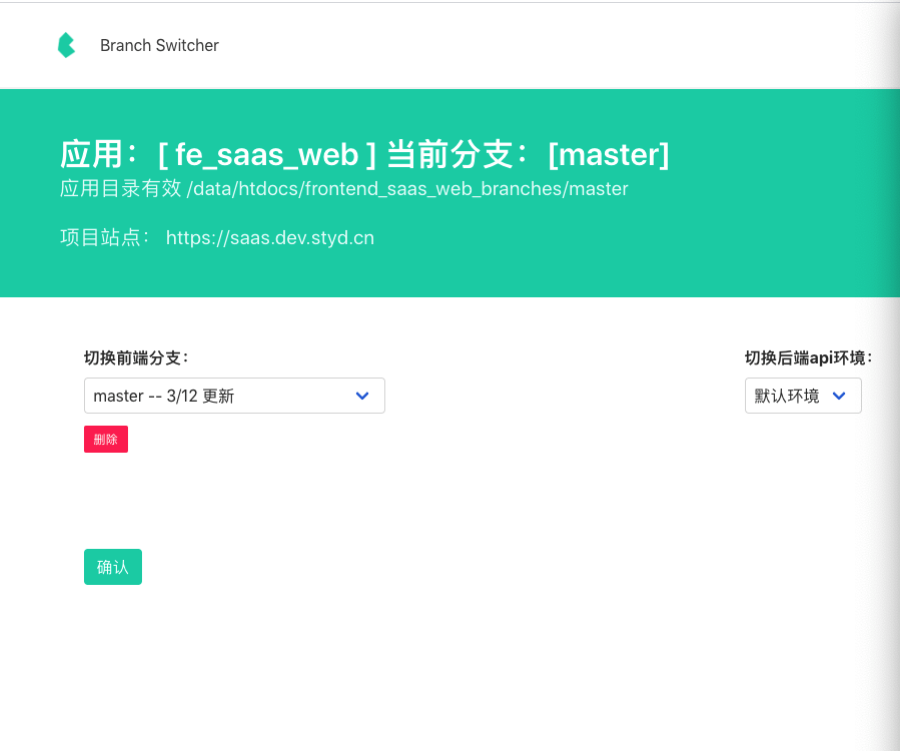

# branch-switcher Docker 镜像
前端资源分支切换器,适用于同环境不同版本浏览器资源代码的切换


* 




```shell
npm run dev
```

### 原理

* 通过查找配置文件中的 webroot_branches 目录下的文件夹来遍历出分支文件夹名称 供 ui 下拉选择使用
* 选中分支 设定相关Cookie


分支切换工具 docker 镜像

```shell
# app.json为配置
# /data 为需要检索目录结构的文件夹
docker run -p 3030:3030 -v apps.json:/data/conf/apps.json -v /data:/data flynnlee/branch-switcher
```

apps.json 为配置文件

```json
{
  "demo": {
    // 项目名称 通过 http://localhost:3030/app/demo 访问
    "webroot_branches": "/data/htdocs/oa_frontend_branches" // 多分支用的根目录 这里的/data 需要 volume
  }
}
```

### 使用

- nginx 配置 参考[./nginx.conf](./nginx.conf)

- 和 gitlab 分支删除对应 `/app/:app_name/gitlab`
